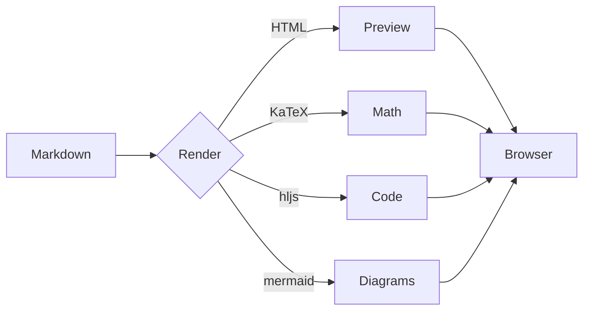
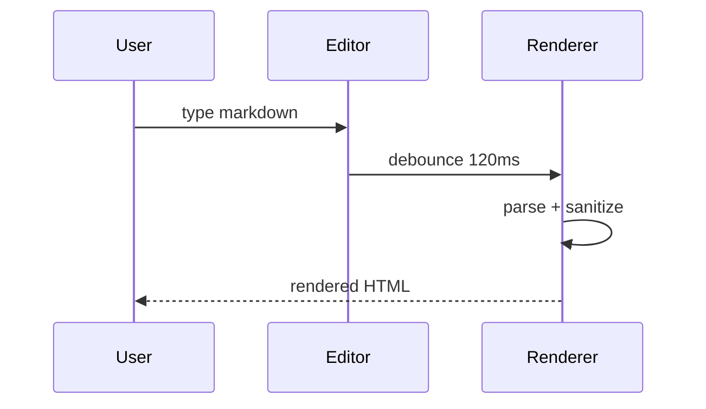

# Welcome to **mdview**

A browser-only markdown viewer. Everything runs locally — no upload,
no server, no analytics. Drop a file, paste markdown, or just start typing.

> **Tip:** Press <kbd>?</kbd> for keyboard shortcuts.

---

## What you can do

- **Side-by-side preview** with synchronized scrolling
- **Selection mirroring** — highlight text in either pane and the other follows
- **Four view modes:** split / stacked / source only / preview only
- **Math, code, diagrams, tables, task lists, footnotes**
- **Drag-and-drop** or paste markdown to load
- **Export** as HTML, print to PDF, or download the source
- **Persists** across reloads (your last session is restored automatically)
- **Light / dark theme** with auto-detection
- **Mobile-friendly** — adapts to narrow screens and touch input

## Formatting

You can mix **bold**, *italic*, ***both***, ~~strikethrough~~, `inline code`,
and even <mark>highlights</mark>. Plus auto-linkified URLs like
<https://commonmark.org/> and named links such as [CommonMark spec].

[CommonMark spec]: https://spec.commonmark.org/

### Lists

Unordered:

- Apples
- Pears
  - Anjou
  - Bosc
- Citrus

Ordered:

1. Wake up
2. Make coffee
3. Read markdown

Task lists:

- [x] Render markdown
- [x] Sync scroll
- [x] Mirror selection
- [ ] Achieve enlightenment

## Math (KaTeX)

Inline math uses `$...$`: the area of a circle is $A = \pi r^2$,
and Euler's identity is $e^{i\pi} + 1 = 0$.

Block math uses `$$...$$` on its own lines:

$$
\frac{\partial}{\partial t}\Psi(\mathbf{r}, t) \;=\;
\frac{1}{i\hbar}\,\hat{H}\,\Psi(\mathbf{r}, t)
$$

$$
\begin{aligned}
\nabla \cdot \mathbf{E} &= \frac{\rho}{\varepsilon_0} \\
\nabla \cdot \mathbf{B} &= 0 \\
\nabla \times \mathbf{E} &= -\frac{\partial \mathbf{B}}{\partial t} \\
\nabla \times \mathbf{B} &= \mu_0 \mathbf{J} + \mu_0 \varepsilon_0 \frac{\partial \mathbf{E}}{\partial t}
\end{aligned}
$$

## Code

Inline `code` with backticks. Fenced blocks with syntax highlighting:

```js
function fibonacci(n) {
  if (n < 2) return n;
  let [a, b] = [0, 1];
  for (let i = 2; i <= n; i++) [a, b] = [b, a + b];
  return b;
}
```

```python
def fibonacci(n: int) -> int:
    a, b = 0, 1
    for _ in range(n):
        a, b = b, a + b
    return a
```

```bash
# Build a sequence quickly
seq 1 10 | awk '{s+=$1} END {print s}'
```

## Diagrams (Mermaid)





## Tables

| Feature              | Library         | Notes                       |
|----------------------|-----------------|-----------------------------|
| Parser               | markdown-it     | Permissive CommonMark + GFM |
| Editor               | CodeMirror 5    | Markdown mode               |
| Math                 | KaTeX           | Fast, no MathJax dependency |
| Code highlighting    | highlight.js    | github theme, auto-language |
| Diagrams             | Mermaid         | Loaded only when used       |
| Sanitization         | DOMPurify       | Trust nothing               |

## Blockquotes

> "Any sufficiently advanced technology is indistinguishable from magic."
> — Arthur C. Clarke

Nested:

> Outer quote.
>
> > Inner quote with **emphasis** and `code`.
> >
> > Even further: $\sum_{n=1}^{\infty} \frac{1}{n^2} = \frac{\pi^2}{6}$.

## Footnotes-ish references

A reference-style link to the [Markdown Guide][md-guide]
and an inline reference to `markdown-it`.

[md-guide]: https://www.markdownguide.org/

## Details / summary

<details>
<summary>Click to expand</summary>

Inside a `<details>` element you can hide longer content until the reader wants
to see it. This is great for collapsing API docs, large code listings, or
addenda.

```yaml
example:
  collapsed: true
  hidden_until: requested
```

</details>

---

## What's next?

Try loading your own file (top-right open icon, or just drag one anywhere),
or paste a chunk of markdown into the page. Switch view modes with
<kbd>Alt</kbd>+<kbd>1</kbd>…<kbd>4</kbd>. Resize the divider by dragging it,
double-click it to reset to 50/50.
